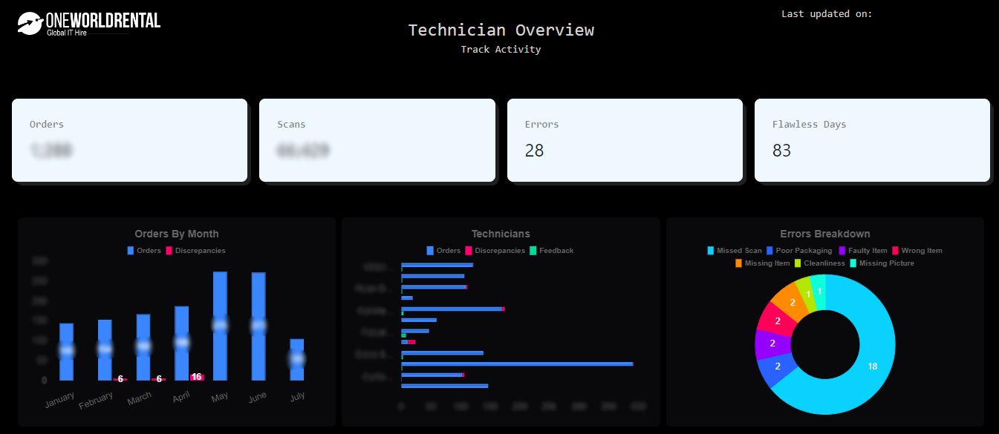

<h1 align="center">Tech Dashboard</h1>
<p align="center">Welcome! This dashboard tracks technician's scanner activity.</p>



## Running the Project Locally

To run this project in development mode, you'll need to follow these steps:

1. **Clone the Repository**: 
    ```bash
    git clone https://github.com/JoelOWR/DashJS
    ```

2. **Navigate into the Project Root Directory and switch to the backend folder**: 
    ```bash
    cd DashJS/backend
    ```

3. **Activate the Virtual Environment**:
    - On **Windows**:
    ```bash
    .\env\Scripts\Activate
    ```
    - On **Unix or MacOS**:
    ```bash
    source env/bin/activate
    ```

4. **Install Backend Dependencies**:
    ```bash
    pip install -r requirements.txt
    ```

5. **Start the backend**: 
    ```bash
    python app.py
    ```    

6. **Navigate into the Project Root Directory and switch to the frontend folder**: 
    ```bash
    cd ../frontend
    ```

7. **Install Frontend Dependencies**:
    ```bash
    npm install
    ```

8. **Start the frontend**: 
    ```bash
    npm run dev
    ```

9. **Access the Dashboard**:
    The Dash application should be running on [http://localhost:5173/](http://localhost:5173/), check your IDE console for more information.

## Requirements

To run this project locally, you'll need the following:

- Python **3.12.2** or higher installed on your operating system.
